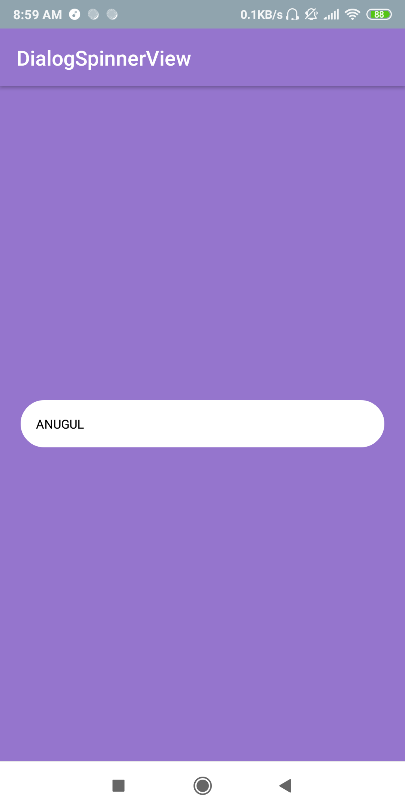
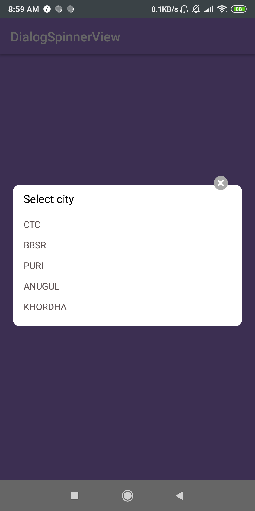

# DialogSpinner
It is the modified curved dialog spinner
[](https://jitpack.io/#sanjayajena37/DialogSpinner)

This is the modified dialog spinner for android it doesn't required ANDROID X it works in normal ANDROID.
It works normal spinner as like as you used in the spinner.

# Screenshots
These are the screenshots of the images.


<div class="row" align="center">


</div>
  
  
  
  # Setup
  Add it in your root build.gradle at the end of repositories:
```ruby
allprojects {
 repositories {
   ...
   maven { url 'https://jitpack.io' }
 }
}
```
Add the dependency in your app label project
```ruby
implementation 'com.github.sanjayajena37:DialogSpinner:1.0.3'
```
# Usage
First you create a TextView then set onclick listner to this textview the call this method.
```ruby
txtView.setOnClickListener(new View.OnClickListener() {
   @Override
   public void onClick(View view) {
        ArrayList<String> arrayList=new ArrayList<>();
        arrayList.add("CTC");
        arrayList.add("BBSR");
        arrayList.add("PURI");
        arrayList.add("ANUGUL");
        arrayList.add("KHORDHA");
                
        DialogSpinner.show(MainActivity.this,"Select city",arrayList,txtView);
     }
 });
```
Parameter explaining
```ruby
DialogSpinner.show(Context context, String header, ArrayList<String> arrayList, final TextView whereYoucansetAfterClickIt);
```
# Contact
* <bold><strong>Email:</strong></bold> sanjayajena37@gmail.com
* <bold><strong>Facebook:</strong></bold> https://www.facebook.com/sanjaya.jena.3766

# Version
Latest version is 1.0.3

# Licence

Copyright 2019 Sanjaya Jena
Licensed under the Apache License, Version 2.0 (the "License");
you may not use this file except in compliance with the License.
You may obtain a copy of the License at

    http://www.apache.org/licenses/LICENSE-2.0

Unless required by applicable law or agreed to in writing, software
distributed under the License is distributed on an "AS IS" BASIS,
WITHOUT WARRANTIES OR CONDITIONS OF ANY KIND, either express or implied.
See the License for the specific language governing permissions and
limitations under the License.

